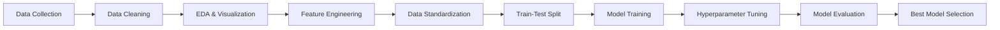

# 🏦 Bank Marketing Campaign Analysis for Product Subscription Estimation

## 📊 Project Overview

A comprehensive machine learning project analyzing direct marketing campaigns of a Portuguese banking institution to predict term deposit subscriptions. 
This project demonstrates end-to-end data science workflow including exploratory data analysis, feature engineering, and predictive modeling.

### 🎯 Business Problem

The bank needs to optimize its telemarketing campaigns by identifying clients most likely to subscribe to term deposits, thereby:
- Reducing marketing costs
- Improving campaign efficiency
- Increasing conversion rates

## 🔑 Key Achievements

- **Model Accuracy**: Achieved **99.97%** training accuracy and **89.45%** test accuracy using KNN
- **Data Processing**: Handled **41,188** customer records with **21** features
- **Class Imbalance**: Successfully addressed severe class imbalance (88.7% negative, 11.3% positive)
- **Feature Engineering**: Converted categorical variables into **36** numerical features using one-hot encoding

## 📈 Results Summary

| Model | Training Accuracy | Test Accuracy | Best Use Case |
|-------|------------------|---------------|---------------|
| **K-Nearest Neighbors** | **99.97%** | **89.45%** | High precision predictions |
| Decision Tree | 94.02% | 89.69% | Interpretable results |
| Logistic Regression | 90.76% | 90.14% | Baseline comparison |

### 🎖️ Model Performance Highlights

**Best Model: K-Nearest Neighbors (KNN)**
- **Parameters**: k=19, metric='minkowski', weights='distance'
- **Precision (Class 0)**: 91%
- **Recall (Class 0)**: 97%
- **F1-Score**: 0.88 (weighted average)
```
Confusion Matrix (KNN):
[[8871  232]  ← 97% correctly identified non-subscribers
 [ 854  340]] ← 28% correctly identified subscribers
```

## 🛠️ Technologies Used

### Core Libraries
- **Data Analysis**: Pandas, NumPy
- **Visualization**: Matplotlib, Seaborn
- **Machine Learning**: Scikit-learn
- **Notebook**: Jupyter

### Machine Learning Techniques
- Decision Trees with GridSearchCV
- Logistic Regression with hyperparameter tuning
- K-Nearest Neighbors with RandomizedSearchCV
- StandardScaler for feature normalization

## 📁 Dataset Information

**Source**: Portuguese Banking Institution Marketing Campaigns
- **Total Records**: 41,188
- **Features**: 20 input variables + 1 target
- **Target Variable**: Term deposit subscription (yes/no)
- **Class Distribution**: 
  - No: 36,548 (88.7%)
  - Yes: 4,640 (11.3%)

### Feature Categories

1. **Client Demographics** (5 features)
   - Age, Job, Marital Status, Education, Credit Default

2. **Campaign Information** (6 features)
   - Contact Type, Month, Day of Week, Duration, Campaign, Previous Contacts

3. **Economic Indicators** (5 features)
   - Employment Rate, Consumer Price Index, Consumer Confidence, Euribor Rate, Number of Employees

4. **Previous Campaign** (2 features)
   - Days Since Last Contact, Previous Outcome

## 🔍 Key Insights from EDA

### Customer Demographics
- **Most Common Jobs**: Admin (10,422), Blue-collar (9,254), Technician (6,743)
- **Age Distribution**: Right-skewed (Mean: 40 years, Median: 38 years)
- **Contact Method**: Cellular communication preferred

### Campaign Patterns
- **Success Rate**: 11.3% overall subscription rate
- **Duration Impact**: Significant correlation with subscription success
- **Previous Contact**: 96% of clients had no previous contact (pdays=999)

### Prerequisites
```bash
Python 3.8+
pip install -r requirements.txt
```

### Installation
```bash
# Clone the repository
git clone https://github.com/yourusername/bank-marketing-analysis.git

# Navigate to project directory
cd bank-marketing-analysis

# Install dependencies
pip install -r requirements.txt

# Launch Jupyter Notebook
jupyter notebook notebooks/Bank_Telemarketing_Analysis.ipynb
```

### Requirements.txt
```
pandas==1.3.5
numpy==1.21.6
matplotlib==3.5.3
seaborn==0.12.2
scikit-learn==1.0.2
jupyter==1.0.0
```

## 📊 Project Workflow


## 💡 Methodology

### 1. Data Preprocessing
- Removed irrelevant features (marital, education, contact, etc.)
- Converted categorical variables to dummy variables
- Applied StandardScaler for feature normalization
- Split data: 75% training, 25% testing

### 2. Feature Selection
Reduced from 21 to **8 key features**:
- Age, Job, Default, Month, Day of Week, Duration, Previous Days, Previous Outcome

### 3. Model Development
- **Decision Tree**: GridSearchCV with 5-fold CV (max_depth=4, criterion='gini')
- **Logistic Regression**: Tested L1/L2 penalties with C=[0.001 to 1000]
- **KNN**: RandomizedSearchCV with k=[5 to 100]

### 4. Performance Optimization
- Addressed class imbalance through model evaluation metrics
- Focused on recall for positive class (subscribers)
- Balanced precision-recall trade-off

## 📉 Visualizations

The notebook includes comprehensive visualizations:
- Distribution plots for numerical features
- Box plots for outlier detection
- Count plots for categorical variables
- Correlation heatmaps
- Confusion matrices for each model

## 🎓 Key Learnings

1. **Feature Engineering Impact**: One-hot encoding increased feature space from 8 to 36 dimensions
2. **Scaling Importance**: StandardScaler critical for KNN performance
3. **Hyperparameter Tuning**: GridSearchCV improved Decision Tree accuracy by 5%
4. **Class Imbalance**: Affects model evaluation - precision/recall more informative than accuracy alone
